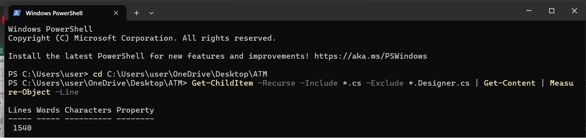

# ATM Application

Це десктоп-додаток **банкомата**, створений за допомогою **C# (.NET Windows Forms)** із підключенням до **SQL Server**.

## Функціональність

Проект реалізує стандартний функціонал банкомату та терміналу:

- **Авторизація**: Можливість зайти в акаунт за ім'ям, номером картки та PIN-кодом (AuthorizationForm).

- **Реєстрація в системі**: Можливість зареєструватись в банку з можливістю генерації унікального номеру картки та додаванням даних про акаунт у базу даних (RegisterForm).

- **Управління акаунтом**: Можливість змінювати дані акаунту, в тому числi PIN-код, але для цього треба підтвердити старий PIN-код. Також, можна видалити акаунт (AccountManagementForm).

- **Можливість проведення різних транзакцій та операцій**: Є можливість поповнення картки готівкою (імітація), зняття суми та пересилання суми грошей на іншу картку. Також є можливість перегляду поточного балансу картки (AutomatedTellerMachineForm).

- **Перегляд історії транзакцій**: За допомогою кнопки "Переглянути історію транзакцій", можна перейти на сторінку, де висвічуюються всі транзакції пов'язані з цим акаунтом (поповнення рахунку, зачислення чи відправлення грошей, зняття коштів). Дані беруться з бази даних, з таблиці Transactions (TransactionHistoryForm).

- **Закриття сторінки банкомату через бездіяльність**: Після 30 секунд бездіяльності, на сторінці банкомату, користувачу висвічується повідомленн про те, що сесія завершена через бездіяльність, після цього користувача переносить назад на сторінку авторизації.

## Запуск проекту локально

1. Склонуйте репозиторій:
> git clone https://github.com/AndriySymon/lab6_kpz.git

>cd lab6_kpz

2. Налаштуйте базу даних
- Відкрийте SQL Server Management Studio.
- Створіть базу ATMDatabase.
- Виконайте SQL-скрипт initialize.sql для створення таблиць Accounts та Transactions.

3. В Visual Studio:
- Відкрийте рішення.
- Налаштуйте рядок підключення у AccountRepository.cs.
- Запустіть проєкт.

## Принципи програмування

- **Single Responsibility Principle (SRP)**

Кожен клас відповідає лише за одну дію - наприклад, [AccountRepository](https://github.com/AndriySymon/lab6_kpz/blob/master/ClassLibrary2/AccountRepository.cs) обробляє лише доступ до БД.
Такі форми, як AccountManagementForm, RegisterForm — відповідають за логіку інтерфейсу користувача. А, наприклад, SessionManager відповідає за роботу з сесіямиЮ також цей код можна перевикористовувати, що є дуже зручно.

- **Open/Closed Principle**

Класи відкриті для розширення, але закриті для модифікації завдяки інтерфейсам. Якщо користувач захоче підключити іншу БД, він зможе створити інший клас, який реалізує існуючі інтерфейси і підставити його - без зміни в формі.

- **Interface Segregation Principle**

Для кожного інтерфейсу ([ICreatableAccount](https://github.com/AndriySymon/lab6_kpz/blob/master/ClassLibrary2/Interfaces/ICreatableAccount.cs), [IDeletableAccount](https://github.com/AndriySymon/lab6_kpz/blob/master/ClassLibrary2/Interfaces/IDeletableAccount.cs), [IReadableAccount](https://github.com/AndriySymon/lab6_kpz/blob/master/ClassLibrary2/Interfaces/IReadableAccount.cs), [IUpdatableAccount](https://github.com/AndriySymon/lab6_kpz/blob/master/ClassLibrary2/Interfaces/IUpdatableAccount.cs)) створено окремий файл. Таким чином, код відповідає SRP, кожна форма залежить лише від того, що потрібно, а не від всього, що вміє AccountRepository. Кожен інтерфейс бере ту інформацію, яка йому дійсно потрібна. Також, це підвищує читабельність коду.

- **YAGNI (You Aren't Gonna Need It)**

    - Проект містить лише необхідні функції без надлишкового коду.
    - Кожна функція та метод мають свої призначення.

- **KISS (Keep It Simple, Stupid)**

    - У моїх методах, таких як [btnCreateAccount_Click](https://github.com/AndriySymon/lab6_kpz/blob/8175b87d28ed88ffa255659bce977c511552e5b3/WindowsFormsApp/RegisterForm.cs#L48), [btnDelete_Click](https://github.com/AndriySymon/lab6_kpz/blob/8175b87d28ed88ffa255659bce977c511552e5b3/WindowsFormsApp/AccountManagementForm.cs#L55), [btnAuthorize_Click](https://github.com/AndriySymon/lab6_kpz/blob/8175b87d28ed88ffa255659bce977c511552e5b3/WindowsFormsApp/AuthorizationForm.cs#L61) - немає зайвих перевантажень, складних перевірок, зайвої логіки. Все структуровано та легко читається.
    - Відповідальність розбита між різними формами (авторизація, реєстрація, управління акаунтом).

 -   **DRY (DON'T REPEAT YOURSELF)**
 
Дотримано принцип DRY, тобто уникнено дублювання логіки.
Файли, у яких використовується принцип DRY: [AccountManagementForm.cs](https://github.com/AndriySymon/lab6_kpz/blob/master/WindowsFormsApp/AccountManagementForm.cs), [AutomatedTellerMachine.cs](https://github.com/AndriySymon/lab6_kpz/blob/master/WindowsFormsApp/AutomatedTellerMachineForm.cs). Наприклад, у файлі AutomatedTellerMachine.cs метод [ResetInactivityTimer](https://github.com/AndriySymon/lab6_kpz/blob/ad0982cdd5a3fdb0241ef2fcff5059a1b41ff315/WindowsFormsApp/AutomatedTellerMachineForm.cs#L78) повторно викликається з різних подій, замість дублювання самого присвоєння secondsInactive = 0.

- **Dependency Inversion Principle**

Використання цього принципу можна побачити, наприклад, у [AuthorizationForm.cs](https://github.com/AndriySymon/lab6_kpz/blob/8175b87d28ed88ffa255659bce977c511552e5b3/WindowsFormsApp/AuthorizationForm.cs#L25). Так, як repo є реалізацією інтерфейсів (IReadableAccount і IUpdatableAccount). Оскільки ми працюємо з абстракціями, а не з конкретними реалізаціями класів, а також, замість того, щоб прямо залежати від конкретного класу AccountRepository, код залежить від інтерфейсів IReadableAccount і IUpdatableAccount. Тому це є прикладом використання принципу DIP.

## Шаблони проектування

**1.Repository Pattern**

Клас [AccountRepository](https://github.com/AndriySymon/lab6_kpz/blob/master/ClassLibrary2/AccountRepository.cs) реалізує інтерфейси IReadableAccount, IDeletableAccount, IUpdatableAccount, ICreatableAccount. Він ізолює логіку доступу до даних від логіки форми. Код у формах не прив'язаний до бази даних напряму. Це дозволяє легко змінити джерело даних.

**2.Observer**

Подія буде повідомляти, коли сталася дія. Наприклад, файл Account є Subject у моєму випадку, а AuthorizationForm є Observer. А подія Authorizated буде повідомляти, коли сталася авторизація. Ось [оголошення події в класі Account](https://github.com/AndriySymon/lab6_kpz/blob/8175b87d28ed88ffa255659bce977c511552e5b3/ClassLibrary2/Account.cs#L15) та [використання при успішній авторизації](https://github.com/AndriySymon/lab6_kpz/blob/8175b87d28ed88ffa255659bce977c511552e5b3/ClassLibrary2/Account.cs#L50). А також, подія Authorizated, застосована у формі [AuthorizationForm](https://github.com/AndriySymon/lab6_kpz/blob/8175b87d28ed88ffa255659bce977c511552e5b3/WindowsFormsApp/AuthorizationForm.cs#L96).

**3.Chain of Responsibility**

Шаблон, який дозволяє передавати запит вздовж ланцюга обробників, доки один із них не обробить його. Реалізовані обробники: [Handlers](https://github.com/AndriySymon/lab6_kpz/tree/master/ClassLibrary2/Handlers)
Реалізація цих обробників у файлі AutomatedTellerMachineForm: [btnTransfer_Click](https://github.com/AndriySymon/lab6_kpz/blob/8175b87d28ed88ffa255659bce977c511552e5b3/WindowsFormsApp/AutomatedTellerMachineForm.cs#L99).

## Техніки рефакторингу

**1.Exctract Interface**

Створено інтерфейси, що ізолюють поведінку та дозволяють легко підмінювати реалізації. Це спрощує заміщення залежностей.

Створені інтерфейси: [ICreatableAccount](https://github.com/AndriySymon/lab6_kpz/blob/master/ClassLibrary2/Interfaces/ICreatableAccount.cs), [IDeletableAccount](https://github.com/AndriySymon/lab6_kpz/blob/master/ClassLibrary2/Interfaces/IDeletableAccount.cs), [IReadableAccount](https://github.com/AndriySymon/lab6_kpz/blob/master/ClassLibrary2/Interfaces/IReadableAccount.cs), [IUpdatableAccount](https://github.com/AndriySymon/lab6_kpz/blob/master/ClassLibrary2/Interfaces/IUpdatableAccount.cs).

**2.Replace Nested Conditional with Guard Clauses**

У методах, наприклад, [btnTransfer_Click](https://github.com/AndriySymon/lab6_kpz/blob/8175b87d28ed88ffa255659bce977c511552e5b3/WindowsFormsApp/AutomatedTellerMachineForm.cs#L99) або [btnWithdraw_Click](https://github.com/AndriySymon/lab6_kpz/blob/8175b87d28ed88ffa255659bce977c511552e5b3/WindowsFormsApp/AutomatedTellerMachineForm.cs#L160), використовується if-return для перевірок. Через відсутність вкладеного коду зменшується глибина коду і покращується розуміння.

**3.Replace Concrete Implementation with Abstraction**

Використано інтерфейси замість прямої прив'язки до AccountRepository. Це знижує зв'язаність та дозволяє гнучко змінювати реалізацію.

Створені інтерфейси: [ICreatableAccount](https://github.com/AndriySymon/lab6_kpz/blob/master/ClassLibrary2/Interfaces/ICreatableAccount.cs), [IDeletableAccount](https://github.com/AndriySymon/lab6_kpz/blob/master/ClassLibrary2/Interfaces/IDeletableAccount.cs), [IReadableAccount](https://github.com/AndriySymon/lab6_kpz/blob/master/ClassLibrary2/Interfaces/IReadableAccount.cs), [IUpdatableAccount](https://github.com/AndriySymon/lab6_kpz/blob/master/ClassLibrary2/Interfaces/IUpdatableAccount.cs).

**4.Replace Magic Number with Symbolic Constant**

Було використано "магічні числа" для того, щоб покращити читабельність, спростити підтримку. Використовуються такі константи у кнопці [btnWithdraw_Click](https://github.com/AndriySymon/lab6_kpz/blob/8175b87d28ed88ffa255659bce977c511552e5b3/WindowsFormsApp/AutomatedTellerMachineForm.cs#L165), а реалізовуються ці числа у класі [AmountValidator](https://github.com/AndriySymon/lab6_kpz/blob/8175b87d28ed88ffa255659bce977c511552e5b3/ClassLibrary2/AmountValidator.cs#L14), для того, щоб слідувати принципу SRP. Таким чином, за допомогою цих чисел, визначено мінімальну та максимальну суму зняття готівки. 

Також ці числа використовуються у класі [RegisterForm](https://github.com/AndriySymon/lab6_kpz/blob/8175b87d28ed88ffa255659bce977c511552e5b3/WindowsFormsApp/RegisterForm.cs#L19), за допомогою цих "магічних чисел", задано перших 4 числа, з яких має починатись номер картки, кількість чисел, які мають рандомно згенеруватись після перших чотирьох чисел, а також, задано баланс 0 при створенні картки.

**5.Introduce Parameter Object**

В моєму випадку, метод [btnCreateAccount_Click](https://github.com/AndriySymon/lab6_kpz/blob/8175b87d28ed88ffa255659bce977c511552e5b3/WindowsFormsApp/RegisterForm.cs#L60) має багато параметрів. Для того, щоб полегшити передачу даних та зменшити кількість параметрів у методах та конструкторах, було створено клас [Account](https://github.com/AndriySymon/lab6_kpz/blob/master/ClassLibrary2/Account.cs), що містить усі ці параметри. 

Також, за допомогою цієї техніки покращується читабельність коду.

**6.Move Method**

У класі Account було застосовано метод TryWithdraw, таким чином було перенесено всю логіку, яка стосується обробки балансу, до класу Account. У формі залишалась лише взаємодія з інтерфейсом користувача та виклик методу. 

Повний перегляд змін можна побачити на гілці [Move_Method_Add](https://github.com/AndriySymon/lab6_kpz/tree/Move_Method_Add).

**7.Extract Class**

Було створено новий клас [AmountValidator](https://github.com/AndriySymon/lab6_kpz/blob/8175b87d28ed88ffa255659bce977c511552e5b3/ClassLibrary2/AmountValidator.cs#L14), про який було сказано раніше у техніці Replace Magic Number with Symbolic Constant. Цей клас зменшив навантаження на клас Account і зробив валідаційні правила повторно використовуваними та зручними для тестування.

Після змін клас [Account](https://github.com/AndriySymon/lab6_kpz/blob/master/ClassLibrary2/Account.cs) чистий - він не відповідає за валідацію.

Після створення AmountValidator його можна легше протестувати а також можна повторно використовувати, наприклад, при переказах коштів.

## Технології

- Visual Studio 2022
- .NET Framework 4.7.2
- SQL Server 20
- Система керування версіями Git

## Підрахунок кількості рядків

## Автор

- Симон Андрій, ІПЗ-23-5
